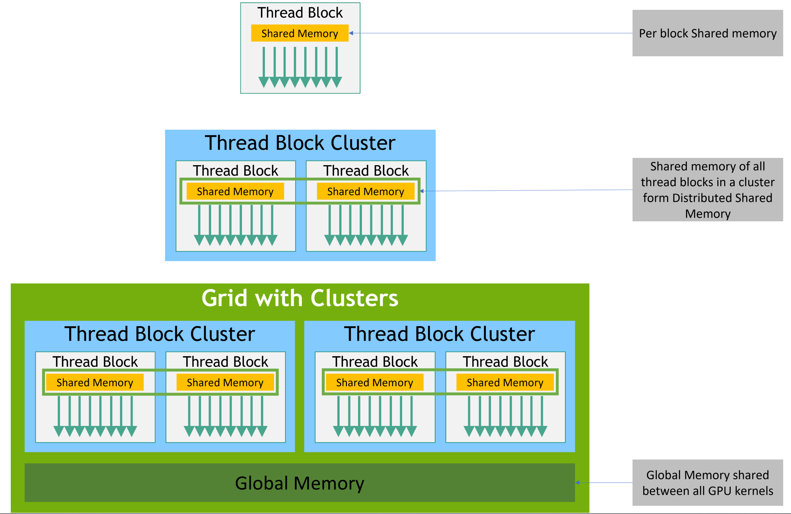

---

# 📘 PMPP Book – Day 2 Notes

## 🧵 Threads and Blocks

```
Threads → Blocks → Grid
```

### 🔄 CPU vs GPU Threads

> **Why should GPU threads make sense?**

* **GPU threads** are extremely lightweight and **require only a few clock cycles** to be generated and scheduled.
* In contrast, **CPU threads** are heavyweight and **require thousands of clock cycles** for creation and context switching.
* This enables GPUs to launch **thousands of threads** efficiently, ideal for data-parallel workloads.

---

## 🔁 Multiple Kernels in CUDA

* CUDA allows launching **multiple kernels**, which are executed **in tandem** with the host (CPU) code.
* Execution is **asynchronous** relative to the host by default, but can be synchronized.


---

## 🔧 Device Function Declarations

In CUDA, device functions are written with specific qualifiers depending on where and how they're called:

* `__global__`: Called from **host**, executed on **device**
* `__device__`: Called and executed on **device**
* `__host__`: Called and executed on **host**

> You can combine qualifiers like `__host__ __device__` to allow functions usable from both host and device.


---

## 🧠 GPU Memory Hierarchy

Understanding memory types is crucial for performance:

* **Global Memory** (slow, large)
* **Shared Memory** (fast, per-block)
* **Constant Memory** (read-only, fast if cached)
* **Registers** (fastest, per-thread)
* **Local Memory** (private to threads, but stored in global memory)



> Accessing **shared** and **register** memory is significantly faster than global memory.

---

## 📚 References

* [PMPP Chapter 2: Data Parallel Computing](https://github.com/R100001/Programming-Massively-Parallel-Processors/tree/master/Chapters/Ch02%20-%20Data%20Parallel%20Computing)
* [NVIDIA CUDA Programming Guide](https://docs.nvidia.com/cuda/cuda-c-programming-guide/#programming-model)

---

