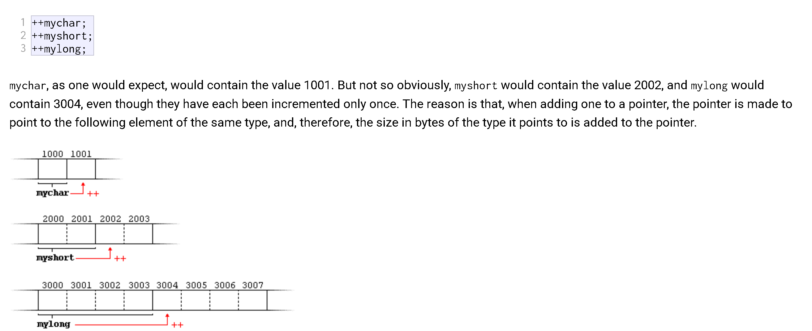

Day 2 Notes:

**Pointers:**

pointer_reassign.cpp tells how one pointer can be be again reused to point to new data 

pointer_array.cpp tells how different ways of assign array values using pointers. 

Pointer arithmetic: 

Pointer_Arithmetic.cpp added 

Rest concepts should be done from section 'Pointers and const'

Ref for Day 2: 
 
https://cplusplus.com/doc/tutorial/pointers/#google_vignette
